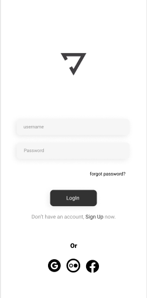

# Yoga-Interface

> Interface da front de um aplicativo

### Ajustes e melhorias

Projeto deve ser atualizado quando tiver o conhecimento necessário sobre desevolvimento para mobile:

- [x] Tornar funcional
- [x] Mudar layout

## 🤝 Colaboradores

Agradecemos às seguintes pessoas que contribuíram para este projeto:

<table>
  <tr>
    <td align="center">
      <a href="https://www.linkedin.com/in/natanael-monteiro-64b1b421a/">
         
        
          <b>Natanael</b>
        
      </a>
    </td>
</table>
  
  

  
